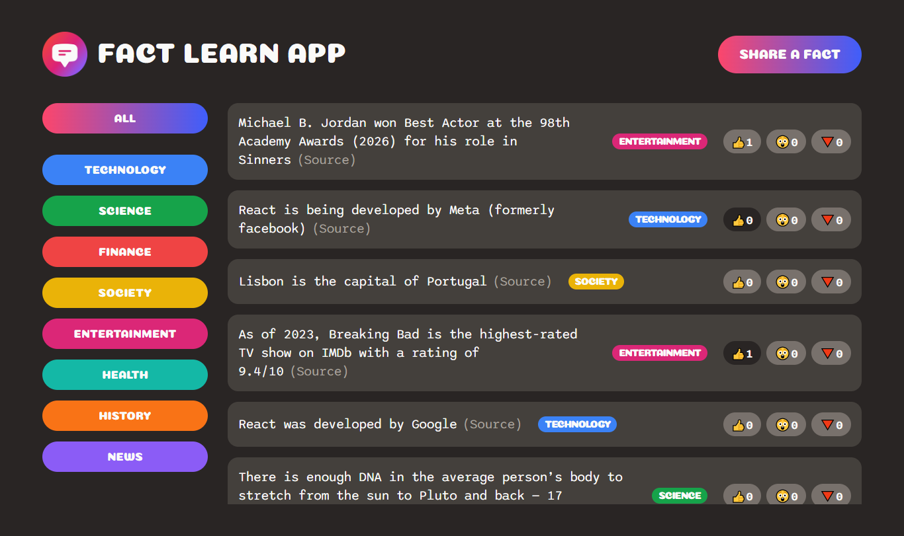
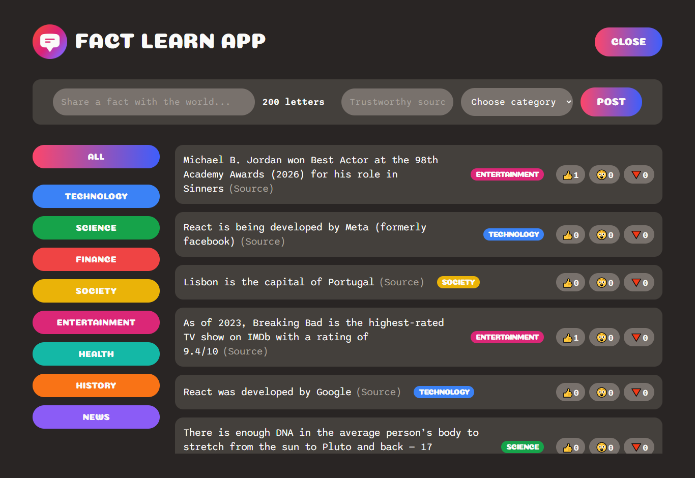

# 📚 Fact Learn App

An interactive fact-sharing web application where users can explore, contribute, and react to interesting facts. Designed with a modern UI and powered by a real-time backend, this app makes learning engaging and community-driven.

---

## 🚀 Live Demo

👉 [https://your-netlify-link.netlify.app](https://ajoydey99-factlearn.netlify.app/)

---

## ✨ Key Features

* ➕ Add new facts with a source link
* 🏷️ Categorize facts for easy browsing
* 👍 Like / 👎 Dislike reactions
* 🤯 “Awesome” reaction button
* ⚡ Real-time data updates
* 📱 Responsive design for all screen sizes

---

## 🛠️ Tech Stack

* Frontend: HTML, CSS, React
* Backend / Database: Supabase
* Deployment: Netlify

---

## ⚙️ Getting Started

### 1. Clone the Repository

* git clone https://github.com/your-username/fact-learn-app.git
* cd fact-learn

### 2. Install Dependencies

* npm install
* npm install @supabase/supabase-js

### 3. Run Locally

* npm run start

---

## 🧠 How It Works

* Users can submit facts with a source link
* Facts are categorized and stored in Supabase
* Users react with:

  * 👍 Like
  * 👎 Dislike
  * 🤯 Awesome
* Data updates in real-time without page reload

---

## 📸 Screenshots

(Add your screenshots here)

---

## 📌 Future Improvements

* 🔐 User authentication
* 🔍 Search & filter
* 📊 Trending system
* 🌙 Dark mode
* 🧾 Pagination

---

## 🤝 Contributing

1. Fork the repo
2. Create a branch: git checkout -b feature/your-feature
3. Commit changes
4. Push to GitHub
5. Open a Pull Request

---

## 👨‍💻 Author

Ajoy Dey
https://github.com/ajoydey99

---

## ⭐ Support

If you like this project, give it a ⭐ on GitHub!
